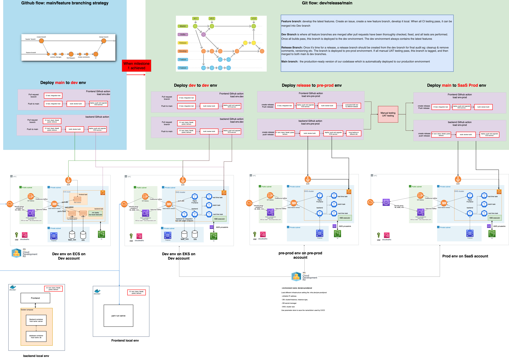
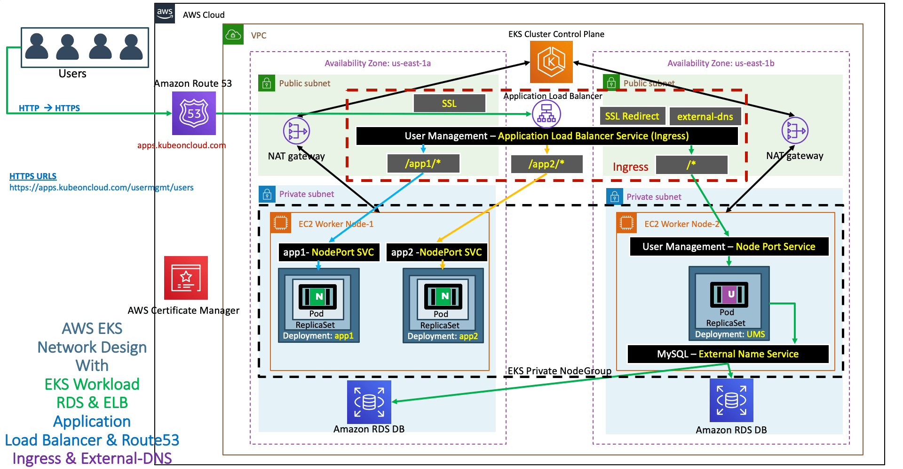
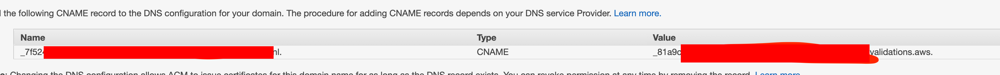

# UniFrame infrastructure
This repository includes CDK code, helm charts and scripts to deploy the infrastructure for UniFrame.

## Workflow
The follow chart is describing the CICD and Infra at a glance.


## Continue Integration
before push, run black, isort, flake8, mypy and pytest
```sh
isort aws app.py
black -l 80 aws app.py
flake8 --config setup.cfg aws app.py
mypy aws
```

## Deploy
```bash
./cdk-deploy-to.sh 123457689 us-east-1 "$@"

./scripts/helm-install-uniframe.sh -p com-uniframe -e dev
```

**After helm install application, it will take some time (30 min?) to make ssl certificate fully functional**

It deploys these CDK stacks
- foundation_stack: 
  - CD deployment related resources
  - ECR repository
  - ECR read only role: a role can only read ECR local repository for local deployment
  - VPC: the vpc 
  - bastion instance for DB connection
  - certication manager: certificates connect with route53 (need manual validation later?)
  - Elastic load balancer security group: security group for ELB, used by ECS and EKS
- s3_stack:
  - s3 bucket for data and nm result
- db_stack
  - RDS related db, secret, security group,etc
- service_stack_eks_managed
  - deploy EKS cluster and some essential helm charts like application load balancer controller, external-DNS
  - **applicaiton is deployed by helm chart k8s/uniframe**

The following CDK stacks are used for deploying UniFrame on AWS ECS. Our current text matching SaaS solution uses EKS. The stacks below is archived under `archive` folder.
- load_balancer_stack
  - Application load balancer. It is dedicated for ECS service
  = **can combine with service_stack_ecs_fargate stack**
- service_stack_ecs_fargate
  - deploy application on ECS

- assume_role stack:
  - allow ECS service role to assume the ECR read only role, for local deployment
  - **Need to do it for EKS role as well**

## Deploy on a new AWS account
1. create cdk bootstrap environment
```sh
DEPLOY_ENV=dev cdk bootstrap aws://492579162332/eu-west-1   
DEPLOY_ENV=prod cdk bootstrap aws://706173320044/eu-west-1   
```

2. create cdk stacks
```sh
./cdk-deploy-to-dev.sh --all
./cdk-deploy-to-prod.sh --all
```

3. Github Oauth secret manager creation if not done
```sh
# go to uniframe-backend folder
./scripts/deploy/create_oauth2_secret_manager.sh -e dev
./scripts/deploy/create_oauth2_secret_manager.sh -e prod
```

4. Run L2 and uniframe helm installation
```sh
./scripts/helm-install-l2.sh -e dev
./scripts/helm-install-uniframe.sh -e dev

./scripts/helm-install-l2.sh -e prod
./scripts/helm-install-uniframe.sh -e prod
```

5. Uninstall L2 and UniFrame
```sh
# first uninstall UniFrame, then L2
./scripts/helm-uninstall-uniframe.sh -e dev
./scripts/helm-uninstall-l2.sh -e dev

./scripts/helm-uninstall-uniframe.sh -e prod
./scripts/helm-uninstall-l2.sh -e prod
```

## DB operation
### Connect to bastion
You can run following script to set up the connection, which is equivalent to the step-by-step approach.
Replace the public and private key file path.

`instance-id` and `postgres-host` are retrieved from AWS parameters store, but you can pass it through from the command line. 
> This will appear your terminal is hanging because it's tunnelling your network traffic.
```bash
./scripts/tunnel-pg.sh --pub /tmp/my_rsa.pub --pri /tmp/my_rsa
```

Now you can connect to PostgreSQL with `psql` as:
```bash
psql -h localhost -d nm -p 54321 -U postgres
```

### Step by step to connect DB via bastion instance (already in the script tunner-pg.sh)
1. Use aws system session manager to forward port
> This will appear your terminal is hanging because it's tunnelling your network traffic.
```bash
aws ssm start-session --target <INSTANCE ID> \
  --document-name AWS-StartPortForwardingSession \
  --parameters "portNumber"=["22"],"localPortNumber"=["9999"]
```

2. Use aws ec2 instance connect to upload a temporary SSH public key. This key will only be valid for 60 seconds
```bash
aws ec2-instance-connect send-ssh-public-key \
  --instance-id <INSTANCE ID> \
  --availability-zone eu-west-1a \
  --instance-os-user ec2-user \
  --ssh-public-key file://<ABSOLUTE PUBLIC KEY FILE PATH>
```

3. Use SSH to route to RDS and backend API
> This will appear your terminal is hanging because it's tunnelling your network traffic. <BE_HOST> is retrieved via *awscli*
```bash
ssh ec2-user@localhost -i <ABSOLUTE PRIVATE SSH KEY FILE PATH>  -p 9999 -N -L 54321:com-uniframe-dev-api-pg.cij4xvr9domv -L 18000:<BE_HOST>:8000
```

4. Use local DB editor or `psql` to connect Postgres on `localhost:54321` . Username and password can be retrieved safely from aws secret manager.
5. Use `http://localhost:18000` to access the backend API on ECS, `18000` can be changed with argument input `local-be-port`


## Connect application container

### SSH into EKS application frontend pod
run `./scripts/ssh-eks-frontend.sh`
```bash
NAME_SPACE=nm
APP=frontend
POD_NAME=`kubectl get pods --no-headers -o custom-columns=":metadata.name" -n ${NAME_SPACE} | grep ${APP} | head -n 1`
kubectl exec -it  -n ${NAME_SPACE} ${POD_NAME}  -- /bin/sh
```

### SSH into EKS application backend pod
run `./scripts/ssh-eks-backend.sh`
```bash
NAME_SPACE=nm
APP=backend
POD_NAME=`kubectl get pods --no-headers -o custom-columns=":metadata.name" -n ${NAME_SPACE} | grep ${APP} | head -n 1`
kubectl exec -it  -n ${NAME_SPACE} ${POD_NAME}  -- /bin/bash
```

### if user ECS version, SSH into the ECS backend container
You can check the cluster name and task id in the console. Replace the cluster id, and task id. Can be improved later to retrieve cluster and task id automatically
```bash
aws ecs execute-command --region eu-west-1 \
  --cluster CLUSTER-ID \
  --task TASK-ID \
  --container fastapi \
  --interactive \
  --command "/bin/bash"
```

## Change host name
If want to change a host name, please do these steps:
1. create a domain name in Route53
2. create a host zone
3. copy host zone id and name and change the comm_props.yaml file
4. ECS:
  - redeploy the load balacer and ECS CDK stack: N.B. since load balancer stack is used by ECS stack, first delete ECS stack, then remove load balancer. After that, cdk deploy
  - in load balancer, a cerfication is created automatically to link the domain
5. EKS: EKS ssl and load balancer is created by AWS load balancer controller and external-dns, and a new host name only affact external-dns.
  - delete nm chart (not sure if needed)
  - update the hostzone_id and name in cluster.add_helm_chart value part (should be updated automatically)
  - cdk deploy to update external-dns chart
  - deploy nm chart, load balancer, and route53 A records will be added automatically


## EKS deployment explanation


### local environment setup
#### Install eksctl
follow this [link](https://docs.aws.amazon.com/eks/latest/userguide/eksctl.html#installing-eksctl)

#### Install kubectl
follow this [link](https://kubernetes.io/docs/tasks/tools/)

#### Install helm
follow this [link](https://helm.sh/docs/intro/install/)

### Deployment
#### CDK
- EKS cluster
- node groups
- aws load balancer controller
- external-dns

### switch to EKS
EKS=$(aws ssm get-parameters --names com-uniframe-dev-ssm-eks-cluster-name --query 

### Explanation of Application LB, Route53 and ingressor
We use the solution [AWS application load balancer controller](https://github.com/kubernetes-sigs/aws-load-balancer-controller) as AWS document describes.

After install AWS application load balancer controller by the CDK stack, an ingressor manifest can indicate the load balancer listener setup, redirect setup, security group, certification, etc in annotation field. The document is [here](https://kubernetes-sigs.github.io/aws-load-balancer-controller/v2.2/guide/ingress/annotations/). Below is an ingressor yaml file for backend.
```yaml
apiVersion: networking.k8s.io/v1
kind: Ingress
metadata:
  name: {{ .Release.Name }}-doc-ingress
  annotations:
    kubernetes.io/ingress.class: alb
    alb.ingress.kubernetes.io/group.name: {{ .Release.Name }}-alb
    alb.ingress.kubernetes.io/scheme: internet-facing
    alb.ingress.kubernetes.io/target-type: ip
    alb.ingress.kubernetes.io/security-groups: {{ .Values.global.ingress.sg }}
    alb.ingress.kubernetes.io/certificate-arn: {{ .Values.global.ingress.acm_arn }}
    alb.ingress.kubernetes.io/backend-protocol: HTTP
    external-dns.alpha.kubernetes.io/hostname: {{ .Values.ingress.hostname_prefix }}.{{ .Values.global.ingress.hostname }}
    # listen to both 80 and 443 port
    alb.ingress.kubernetes.io/listen-ports: '[{"HTTP": 80}, {"HTTPS": 443}]'
    # http to https redirect: https://stackoverflow.com/a/58034777
    alb.ingress.kubernetes.io/ssl-redirect: '443'
    # setup different healthcheck-path for different application
    alb.ingress.kubernetes.io/healthcheck-path: {{ .Values.ingress.healthcheck_path }}

spec:
  rules:
    - host: {{ .Values.ingress.hostname_prefix }}.{{ .Values.global.ingress.hostname }}  
      http:
        paths:
          - path: /
            pathType: Prefix
            backend:
              service:
                name: {{ .Release.Name }}-doc-service
                port:
                  number: 8082
```

When the ingressor is deployed, an AWS application load balancer is deployed automatically.

For the connection between Route53 and application load balancer, we use [external-dns](https://github.com/bitnami/charts/tree/master/bitnami/external-dns) by **bitnami**. external-dns is also installed by the CDK stack. Then, the hostname is specified in the annotation field of the ingress
`external-dns.alpha.kubernetes.io/hostname: {{ .Values.ingress.hostname_prefix }}.{{ .Values.global.ingress.hostname }}`. When ingressor is deployed, besides the load balancer, A and TXT records in Route53 hostzone is added to route the dns A record to the load balancer.

#### install external DNS by helm chart (we integrate in the CDK stack)
helm repo add bitnami https://charts.bitnami.com/bitnami

```
ROUTE53_HOST_ZONE_ID=YOUR_HOST_ZONE_ID
helm upgrade --install external-dns \
  --set provider=aws \
  --set aws.zoneType=public \
  --set txtOwnerId=${ROUTE53_HOST_ZONE_ID} \
  --set domainFilters\[0\]=uniframe.io \
  --set policy=sync \
  bitnami/external-dns

# command below to check if installation finished
kubectl --namespace=default get pods -l "app.kubernetes.io/name=external-dns,app.kubernetes.io/instance=external-dns"
```


### Get log
#### backend
```bash
NAME_SPACE=nm
APP=backend
kubectl logs -f -n ${NAME_SPACE} `kubectl get pods --no-headers -o custom-columns=":metadata.name" -n ${NAME_SPACE} | grep ${APP} | head -n 1`
```

#### frontend
```bash
NAME_SPACE=nm
APP=frontend
kubectl logs -f -n ${NAME_SPACE} `kubectl get pods --no-headers -o custom-columns=":metadata.name" -n ${NAME_SPACE} | grep ${APP} | head -n 1`
```

#### frontend
```bash
NAME_SPACE=nm
APP=frontend
kubectl logs -f -n ${NAME_SPACE} `kubectl get pods --no-headers -o custom-columns=":metadata.name" -n ${NAME_SPACE} | grep ${APP} | head -n 1`
```

### Wire the EKS cluster with your kubectl context
```bash
EKS=$(aws ssm get-parameters --names com-uniframe-dev-ssm-eks-cluster-name --query "Parameters[0].Value" | tr -d '"') ; aws eks update-kubeconfig --name $EKS
```

### checkout kubectl connection with the K8S cluster
```bash
kubectl get svc -n kube-system
```
You should see something similar to the following:
```bash
NAME       TYPE        CLUSTER-IP    EXTERNAL-IP   PORT(S)         AGE
kube-dns   ClusterIP   172.20.0.10   <none>        53/UDP,53/TCP   11h
```

### checkout K8S cluster ingress
``` bash
kubectl get ingress -n nm 
```
You should see something similar to the following:
```bash
NAME                            CLASS    HOSTS                                                     ADDRESS                                                                PORTS   AGE
uniframe-dev-backend-ingress    <none>   api.uniframe.io                             k8s-uniframedevalb-XXXXXXXXXXXX.eu-west-1.elb.amazonaws.com   80      94m
uniframe-dev-doc-ingress        <none>   doc.uniframe.io                             k8s-uniframedevalb-9a5a4a1219-1901503858.eu-west-1.elb.amazonaws.com   80      94m
uniframe-dev-frontend-ingress   <none>   www.uniframe.io,uniframe.io   k8s-uniframedevalb-XXXXXXXXXXXX.eu-west-1.elb.amazonaws.com   80      94m 
```


##  Create AWS public certification for https/ssl
- In AWS certification manager, create a new public certificate, and use *.domain. The DNS validation is not finished automatically (**need to check**). Copy the CNAME and value as the figure below, and insert a CNAME record in Route53 hostzone



### Resource
https://gtsopour.medium.com/kubernetes-ingress-aws-eks-cluster-with-aws-load-balancer-controller-cf49126f8221
- https://rtfm.co.ua/en/kubernetes-update-aws-route53-dns-from-an-ingress/
https://github.com/aws-samples/nexus-oss-on-aws/blob/d3a092d72041b65ca1c09d174818b513594d3e11/src/lib/sonatype-nexus3-stack.ts#L207-L242
- https://github.com/kubernetes-sigs/aws-load-balancer-controller
- dns-external https://kubernetes-sigs.github.io/aws-load-balancer-controller/v2.1/guide/integrations/external_dns/
- ingress annotation https://kubernetes-sigs.github.io/aws-load-balancer-controller/v2.2/guide/ingress/annotations/
- https://rtfm.co.ua/en/kubernetes-update-aws-route53-dns-from-an-ingress/
- https://rtfm.co.ua/en/kubernetes-update-aws-route53-dns-from-an-ingress/
- https://github.com/kubernetes-sigs/external-dns/blob/master/docs/faq.md


## Pod limitation per node
- [stackoverflow: pod limit](https://stackoverflow.com/questions/57970896/pod-limit-on-node-aws-eks/57971006)
- [eni-max-pod](https://github.com/awslabs/amazon-eks-ami/blob/master/files/eni-max-pods.txt)
- [roadmap](https://github.com/aws/containers-roadmap/issues/138)
- [max pod calculator](https://raw.githubusercontent.com/awslabs/amazon-eks-ami/master/files/max-pods-calculator.sh)


